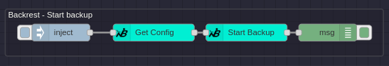

# node-red-contrib-backrest

This Node-RED module allows communication with a [Backrest](https://github.com/garethgeorge/backrest) instance, enabling seamless integration of [restic-powered](https://restic.net/) backups into Node-RED flows.

[](./examples)


If you like this module please consider donating!

[](https://ko-fi.com/B0B51BM7C)

## Features

- Manage Backrest repositories, snapshots, and backup operations within Node-RED.
- Execute restic commands through Backrest’s API.
- Monitor backup events and logs in real-time.
- Automate backup workflows with easy-to-use nodes.

## Installation

You can install via the palette manager in the Node-RED hamburger menu or you can install via terminal with this command:

```sh
npm install node-red-contrib-backrest
```

## Usage

This module provides Node-RED nodes for interacting with Backrest's API, including operations like:
- Retrieving and updating configuration
- Listing snapshots and repository files
- Performing backups, restores, and cleanup tasks
- Running custom restic commands
- Streaming logs and operation events

For a detailed example of how to use these nodes, check out the [examples directory](./examples).

## Contributing

Contributions are welcome! If you'd like to add features, improve documentation, or fix bugs, feel free to open a PR or issue.