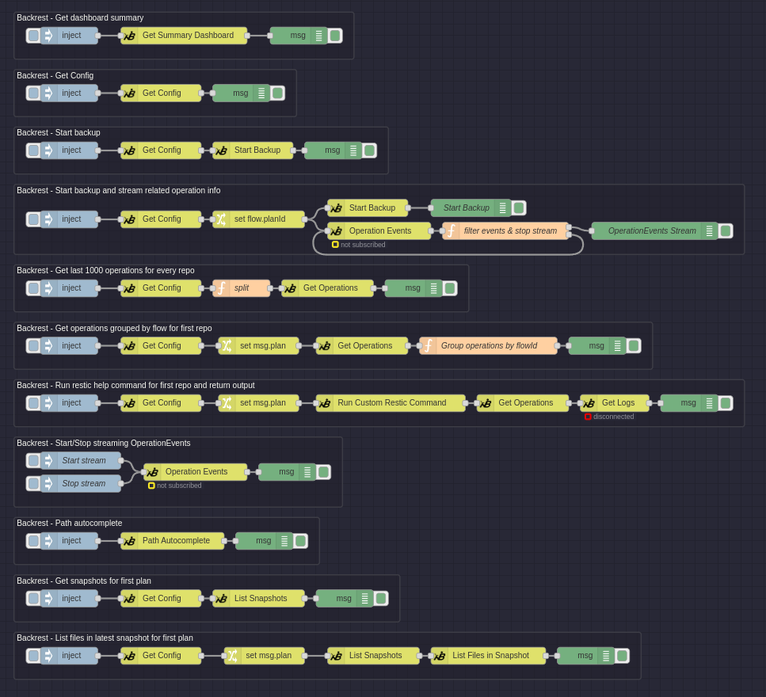

Examples
---

Here is the flow I currently use for developing this module. It showcases how you can do various different tasks.

You can import the example JSON here (copy the full page and import using hamburger menu in Node-RED):

[Example JSON](example.json)

Rendered:

